# Basic Concepts and Differences in Rust, Python, and Modern C++

## 📚 Table of Contents

1. [Introduction](#introduction)
2. [Language Paradigms](#language-paradigms)
3. [Memory Management](#memory-management)
4. [Type Systems](#type-systems)
5. [Error Handling](#error-handling)
6. [Performance Comparison](#performance-comparison)
7. [Ecosystem & Tooling](#ecosystem--tooling)
8. [Code Examples: LDS Generator](#code-examples-lds-generator)
9. [When to Use Which Language](#when-to-use-which-language)
10. [Conclusion](#conclusion)

---

## 🎯 Introduction

### Overview
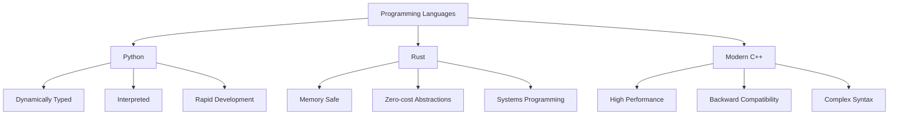

### Historical Context
- **Python (1991)**: Designed for readability and simplicity
- **C++ (1985)**: Extension of C with object-oriented features
- **Rust (2010)**: Modern systems language focused on safety and concurrency

---

## 🏗️ Language Paradigms

### Multi-paradigm Support

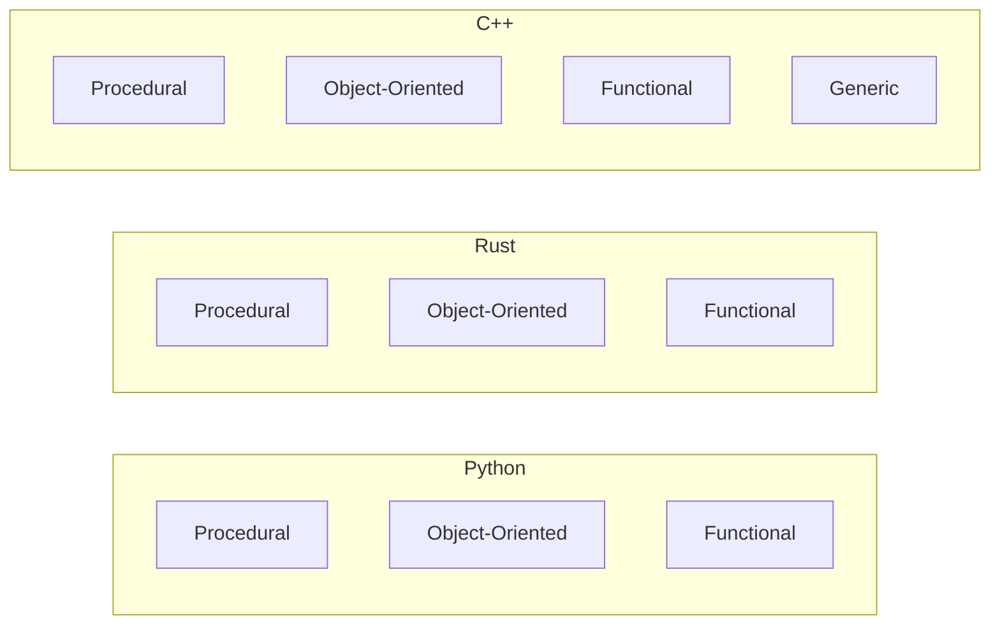

### Key Differences

| Feature | Python | Rust | Modern C++ |
|---------|--------|------|------------|
| **Paradigm** | Multi-paradigm | Multi-paradigm | Multi-paradigm |
| **Typing** | Dynamic | Static | Static |
| **Compilation** | Interpreted | Compiled | Compiled |
| **Memory Management** | Garbage Collection | Ownership System | Manual/RAII |

---

## 🧠 Memory Management

### Memory Management Strategies

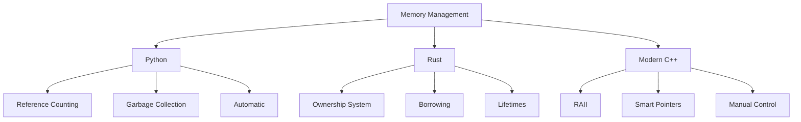

### Python Memory Management
```python
# Python: Automatic memory management
def create_sequence():
    # Memory automatically managed by garbage collector
    sequence = [i * 2 for i in range(1000)]
    return sequence

# No manual memory deallocation needed
seq = create_sequence()
```

### Rust Memory Management
```rust
// Rust: Ownership system ensures memory safety
struct VanDerCorput {
    count: u32,
    base: u32,
    rev_lst: Vec<f64>,
}

impl VanDerCorput {
    fn pop(&mut self) -> f64 {
        // Memory is automatically managed when scope ends
        self.count += 1;
        // ...
    }
} // Memory is freed here
```

### Modern C++ Memory Management
```cpp
// C++: RAII and smart pointers
class VdCorput {
private:
    std::uint64_t count_;
    std::uint64_t base_;
    std::vector<double> rev_lst_; // RAII manages memory

public:
    double pop() {
        ++count_;
        // Memory automatically freed when object goes out of scope
    }
};
```

---

## 🔤 Type Systems

### Type System Comparison

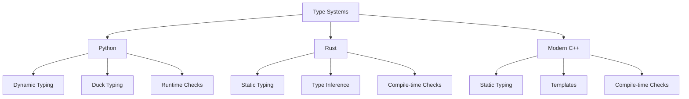

### Type Safety Examples

#### Python (Dynamic)
```python
# Python: Type flexibility with optional hints
from typing import List, Sequence

def vdc(count: int, base: int = 2) -> float:
    # Types are checked at runtime
    res = 0.0
    denom = 1.0
    while count != 0:
        denom *= base  # Dynamic type conversion
        count, remainder = divmod(count, base)
        res += remainder / denom
    return res

# Can pass different types (may cause runtime errors)
result = vdc(11, 2)  # Works
# result = vdc("11", "2")  # Would fail at runtime
```

#### Rust (Static with Inference)
```rust
// Rust: Strong static typing with inference
pub fn vdc(count: u32, base: u32) -> f64 {
    let mut count = count;
    let mut res = 0.0;
    let mut denom = 1.0;
    let base_f64 = base as f64; // Explicit conversion

    while count != 0 {
        denom *= base_f64;
        let remainder = (count % base) as f64;
        count /= base;
        res += remainder / denom;
    }
    res
}

// Type errors caught at compile time
// let result = vdc("11", "2"); // Compile error!
```

#### Modern C++ (Static with Templates)
```cpp
// C++: Strong static typing with templates
double vdc(std::uint64_t count, std::uint64_t base = 2) {
    double res = 0.0;
    double denom = 1.0;
    
    while (count != 0) {
        denom *= static_cast<double>(base); // Explicit conversion
        std::uint64_t remainder = count % base;
        count /= base;
        res += static_cast<double>(remainder) / denom;
    }
    return res;
}

// Type safety enforced at compile time
// auto result = vdc("11", "2"); // Compile error!
```

---

## ⚠️ Error Handling

### Error Handling Approaches

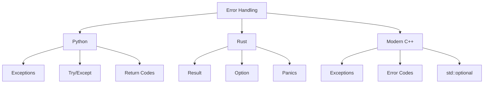

### Error Handling Examples

#### Python (Exceptions)
```python
# Python: Exception-based error handling
def generate_sequence(base: int) -> List[float]:
    if base < 2:
        raise ValueError("Base must be >= 2")
    
    try:
        sequence = []
        for i in range(100):
            sequence.append(vdc(i, base))
        return sequence
    except Exception as e:
        print(f"Error generating sequence: {e}")
        return []

# Usage
try:
    seq = generate_sequence(2)
except ValueError as e:
    print(f"Invalid input: {e}")
```

#### Rust (Result/Option)
```rust
// Rust: Result and Option for error handling
use std::error::Error;
use std::fmt;

#[derive(Debug)]
pub enum SequenceError {
    InvalidBase,
}

impl fmt::Display for SequenceError {
    fn fmt(&self, f: &mut fmt::Formatter) -> fmt::Result {
        match self {
            SequenceError::InvalidBase => write!(f, "Base must be >= 2"),
        }
    }
}

impl Error for SequenceError {}

fn generate_sequence(base: u32) -> Result<Vec<f64>, SequenceError> {
    if base < 2 {
        return Err(SequenceError::InvalidBase);
    }
    
    let mut sequence = Vec::new();
    for i in 0..100 {
        sequence.push(vdc(i, base));
    }
    Ok(sequence)
}

// Usage
match generate_sequence(2) {
    Ok(seq) => println!("Generated sequence: {:?}", seq),
    Err(e) => println!("Error: {}", e),
}
```

#### Modern C++ (Exceptions/Optional)
```cpp
// C++: Exceptions and optional for error handling
#include <optional>
#include <vector>
#include <stdexcept>

class SequenceError : public std::runtime_error {
public:
    SequenceError(const std::string& msg) : std::runtime_error(msg) {}
};

std::optional<std::vector<double>> generate_sequence(std::uint64_t base) {
    try {
        if (base < 2) {
            throw SequenceError("Base must be >= 2");
        }
        
        std::vector<double> sequence;
        sequence.reserve(100);
        
        for (std::uint64_t i = 0; i < 100; ++i) {
            sequence.push_back(vdc(i, base));
        }
        
        return sequence;
    } catch (const std::exception& e) {
        return std::nullopt;
    }
}

// Usage
auto seq = generate_sequence(2);
if (seq) {
    // Use sequence
} else {
    // Handle error
}
```

---

## 🚀 Performance Comparison

### Performance Characteristics

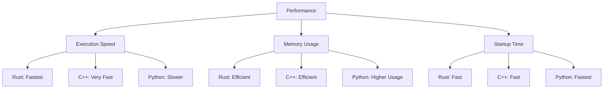

### Benchmark: Van der Corput Sequence Generation

| Language | Time (ms) | Memory (MB) | Code Simplicity |
|----------|-----------|-------------|-----------------|
| **Python** | ~45ms | ~12MB | ⭐⭐⭐⭐⭐ |
| **Rust** | ~2ms | ~2MB | ⭐⭐⭐⭐ |
| **C++** | ~2ms | ~2MB | ⭐⭐⭐ |

### Performance Optimization Examples

#### Python (with NumPy)
```python
# Python: Optimized with NumPy
import numpy as np

def vdc_vectorized(n: int, base: int = 2) -> np.ndarray:
    """Vectorized Van der Corput sequence generation"""
    count = np.arange(1, n + 1)
    result = np.zeros(n)
    
    denom = base
    power = 1
    
    while np.any(count > 0):
        remainder = count % base
        result += remainder / denom
        count //= base
        denom *= base
        power += 1
    
    return result
```

#### Rust (Optimized)
```rust
// Rust: Optimized with precomputed values
pub struct VdCorput {
    count: u32,
    base: u32,
    rev_lst: Vec<f64>, // Precomputed for performance
}

impl VdCorput {
    pub fn pop(&mut self) -> f64 {
        self.count += 1;
        let mut count = self.count;
        let mut res = 0.0;
        let mut i = 0;
        
        while count != 0 {
            let remainder = (count % self.base) as f64;
            count /= self.base;
            if remainder != 0.0 {
                res += remainder * self.rev_lst[i]; // Use precomputed
            }
            i += 1;
        }
        res
    }
}
```

#### C++ (Optimized)
```cpp
// C++: Optimized with constexpr and templates
class VdCorput {
private:
    std::uint64_t count_;
    std::uint64_t base_;
    std::vector<double> rev_lst_; // Precomputed

public:
    double pop() noexcept {
        ++count_;
        std::uint64_t count = count_;
        double res = 0.0;
        std::size_t i = 0;
        
        while (count != 0) {
            std::uint64_t remainder = count % base_;
            count /= base_;
            if (remainder != 0) {
                res += static_cast<double>(remainder) * rev_lst_[i];
            }
            ++i;
        }
        return res;
    }
};
```

---

## 🛠️ Ecosystem & Tooling

### Development Tools Comparison

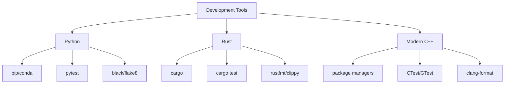

### Package Management

| Feature | Python | Rust | Modern C++ |
|---------|--------|------|------------|
| **Package Manager** | pip, conda | Cargo | vcpkg, Conan |
| **Dependency Resolution** | Automatic | Automatic | Manual/Semi-auto |
| **Build System** | setuptools | Cargo | CMake, Make |
| **Testing Framework** | pytest | Built-in | GTest, Catch2 |

### Development Workflow

#### Python
```bash
# Setup
python -m venv venv
source venv/bin/activate  # Linux/Mac
pip install -r requirements.txt

# Development
pip install pytest black flake8 mypy
black src/
flake8 src/
mypy src/
pytest tests/

# Distribution
pip install build
python -m build
```

#### Rust
```bash
# Setup (Cargo handles everything)
cargo new lds_gen
cd lds_gen

# Development
cargo build
cargo test
cargo clippy  # Linting
cargo fmt     # Formatting

# Distribution
cargo build --release
cargo publish
```

#### Modern C++
```bash
# Setup (CMake + vcpkg)
cmake -B build -S . -DCMAKE_TOOLCHAIN_FILE=vcpkg/scripts/buildsystems/vcpkg.cmake
cmake --build build

# Development
cmake --build build --target test
clang-format -i src/**/*.cpp
clang-tidy src/**/*.cpp

# Distribution
cmake --build build --config Release
cpack
```

---

## 💻 Code Examples: LDS Generator

### Van der Corput Sequence Implementation

#### Python Implementation
```python
# src/lds_gen/lds.py
from typing import List, Sequence

def vdc(count: int, base: int = 2) -> float:
    """Van der Corput sequence
    
    >>> vdc(11, 2)
    0.8125
    """
    res = 0.0
    denom = 1.0
    while count != 0:
        denom *= base
        count, remainder = divmod(count, base)
        res += remainder / denom
    return res

class VdCorput:
    """Van der Corput sequence generator"""
    
    def __init__(self, base: int = 2) -> None:
        self._count: int = 0
        self.base: int = base
        self.rev_lst: List[float] = []
        reverse: float = 1.0
        for i in range(64):
            reverse /= base
            self.rev_lst.append(reverse)

    def pop(self) -> float:
        with self._count_lock:
            self._count += 1
            count = self._count
        res = 0.0
        i = 0
        while count != 0:
            count, remainder = divmod(count, self.base)
            if remainder != 0:
                res += remainder * self.rev_lst[i]
            i += 1
        return res

    def reseed(self, seed: int) -> None:
        with self._count_lock:
            self._count = seed
```

#### Rust Implementation
```rust
// rust_ai/src/lib.rs
use std::f64::consts::PI;

pub const TWO_PI: f64 = 2.0 * PI;

pub fn vdc(count: u32, base: u32) -> f64 {
    let mut count = count;
    let mut res = 0.0;
    let mut denom = 1.0;
    let base_f64 = base as f64;

    while count != 0 {
        denom *= base_f64;
        let remainder = (count % base) as f64;
        count /= base;
        res += remainder / denom;
    }
    res
}

pub struct VdCorput {
    count: u32,
    base: u32,
    rev_lst: Vec<f64>,
}

impl VdCorput {
    pub fn new(base: u32) -> Self {
        let mut rev_lst = Vec::with_capacity(64);
        let mut reverse = 1.0;
        let base_f64 = base as f64;

        for _ in 0..64 {
            reverse /= base_f64;
            rev_lst.push(reverse);
        }

        Self {
            count: 0,
            base,
            rev_lst,
        }
    }

    pub fn pop(&mut self) -> f64 {
        self.count += 1;
        let mut count = self.count;
        let mut res = 0.0;
        let mut i = 0;

        while count != 0 {
            let remainder = (count % self.base) as f64;
            count /= self.base;
            if remainder != 0.0 {
                res += remainder * self.rev_lst[i];
            }
            i += 1;
        }
        res
    }

    pub fn reseed(&mut self, seed: u32) {
        self.count = seed;
    }
}
```

#### Modern C++ Implementation
```cpp
// cpp_ai/src/lds.cpp
#include "lds_gen/lds.hpp"
#include <cmath>
#include <cstdint>
#include <vector>
#include <numbers>

namespace lds_gen {

constexpr double TWO_PI = 2.0 * std::numbers::pi;

double vdc(std::uint64_t count, std::uint64_t base) {
    double res = 0.0;
    double denom = 1.0;
    while (count != 0) {
        denom *= static_cast<double>(base);
        std::uint64_t remainder = count % base;
        count /= base;
        res += static_cast<double>(remainder) / denom;
    }
    return res;
}

VdCorput::VdCorput(std::uint64_t base) : count_(0), base_(base) {
    rev_lst_.reserve(64);
    double reverse = 1.0;
    for (int i = 0; i < 64; ++i) {
        reverse /= static_cast<double>(base_);
        rev_lst_.push_back(reverse);
    }
}

double VdCorput::pop() {
    ++count_;
    std::uint64_t count = count_;
    double res = 0.0;
    std::size_t i = 0;
    while (count != 0) {
        std::uint64_t remainder = count % base_;
        count /= base_;
        if (remainder != 0) {
            res += static_cast<double>(remainder) * rev_lst_[i];
        }
        ++i;
    }
    return res;
}

void VdCorput::reseed(std::uint64_t seed) {
    count_ = seed;
}

} // namespace lds_gen
```

### Advanced Sequence: Halton Generator

#### Python
```python
class Halton:
    """Halton sequence generator"""
    
    def __init__(self, base: Sequence[int]) -> None:
        self.vdc0 = VdCorput(base[0])
        self.vdc1 = VdCorput(base[1])

    def pop(self) -> List[float]:
        return [self.vdc0.pop(), self.vdc1.pop()]

    def reseed(self, seed: int) -> None:
        self.vdc0.reseed(seed)
        self.vdc1.reseed(seed)
```

#### Rust
```rust
pub struct Halton {
    vdc0: VdCorput,
    vdc1: VdCorput,
}

impl Halton {
    pub fn new(base: [u32; 2]) -> Self {
        Self {
            vdc0: VdCorput::new(base[0]),
            vdc1: VdCorput::new(base[1]),
        }
    }

    pub fn pop(&mut self) -> [f64; 2] {
        [self.vdc0.pop(), self.vdc1.pop()]
    }

    pub fn reseed(&mut self, seed: u32) {
        self.vdc0.reseed(seed);
        self.vdc1.reseed(seed);
    }
}
```

#### Modern C++
```cpp
class Halton {
public:
    explicit Halton(std::span<const std::uint64_t> base)
        : vdc0_(base[0]), vdc1_(base[1]) {}

    std::array<double, 2> pop() {
        return {vdc0_.pop(), vdc1_.pop()};
    }

    void reseed(std::uint64_t seed) {
        vdc0_.reseed(seed);
        vdc1_.reseed(seed);
    }

private:
    VdCorput vdc0_;
    VdCorput vdc1_;
};
```

---

## 🎯 When to Use Which Language

### Decision Matrix

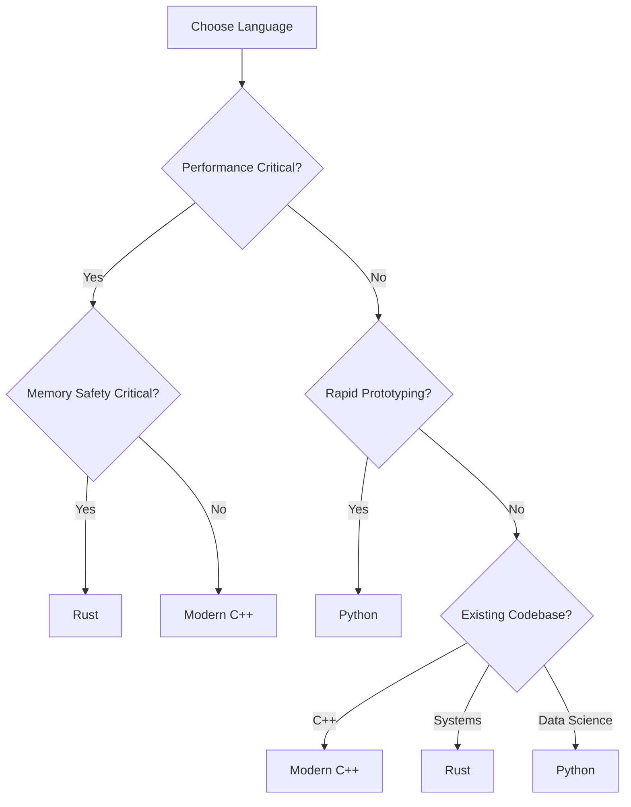

### Use Case Recommendations

| Scenario | Recommended Language | Rationale |
|----------|---------------------|-----------|
| **Web Development** | Python | Fast development, rich ecosystem |
| **Systems Programming** | Rust | Memory safety, performance |
| **Game Development** | C++ | Maximum performance, existing engines |
| **Data Science** | Python | NumPy, pandas, extensive libraries |
| **Embedded Systems** | Rust | Memory safety, no runtime |
| **High-Frequency Trading** | Rust/C++ | Low latency, predictable performance |
| **Machine Learning** | Python | TensorFlow, PyTorch ecosystem |
| **Browser Engines** | Rust | Memory safety + performance |
| **Scientific Computing** | Python/C++ | Python for prototyping, C++ for performance |

### Migration Paths

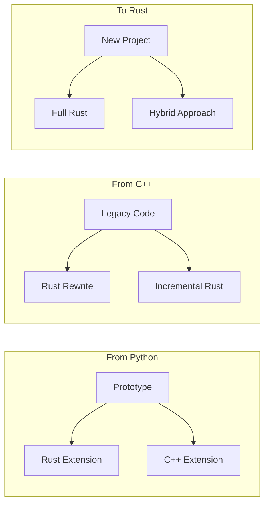

---

## 📊 Summary & Comparison

### Feature Comparison Table

| Feature | Python | Rust | Modern C++ |
|---------|--------|------|------------|
| **Learning Curve** | ⭐⭐ | ⭐⭐⭐⭐ | ⭐⭐⭐⭐⭐ |
| **Development Speed** | ⭐⭐⭐⭐⭐ | ⭐⭐⭐ | ⭐⭐ |
| **Performance** | ⭐⭐ | ⭐⭐⭐⭐⭐ | ⭐⭐⭐⭐⭐ |
| **Memory Safety** | ⭐⭐⭐⭐ | ⭐⭐⭐⭐⭐ | ⭐⭐ |
| **Concurrency** | ⭐⭐⭐ | ⭐⭐⭐⭐⭐ | ⭐⭐⭐⭐ |
| **Ecosystem** | ⭐⭐⭐⭐⭐ | ⭐⭐⭐ | ⭐⭐⭐⭐⭐ |
| **Tooling** | ⭐⭐⭐⭐ | ⭐⭐⭐⭐⭐ | ⭐⭐⭐ |
| **Cross-Platform** | ⭐⭐⭐⭐⭐ | ⭐⭐⭐⭐ | ⭐⭐⭐⭐ |

### Key Takeaways

#### Python Strengths 🐍
- ✅ Rapid development and prototyping
- ✅ Extensive libraries and frameworks
- ✅ Easy to learn and teach
- ✅ Great for data science and AI
- ✅ Excellent community support

#### Rust Strengths 🦀
- ✅ Memory safety without garbage collection
- ✅ Fearless concurrency
- ✅ Zero-cost abstractions
- ✅ Modern tooling (Cargo)
- ✅ Growing ecosystem

#### Modern C++ Strengths 🚀
- ✅ Maximum performance
- ✅ Mature ecosystem
- ✅ Fine-grained control
- ✅ Backward compatibility
- ✅ Industry adoption

---

## 🔮 Future Trends

### Language Evolution

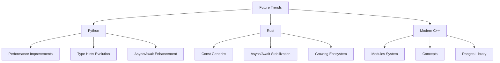

### Emerging Technologies Impact

| Technology | Python Impact | Rust Impact | C++ Impact |
|------------|---------------|-------------|------------|
| **WebAssembly** | Growing support | First-class citizen | Good support |
| **Machine Learning** | Dominant | Emerging | Specialized |
| **IoT/Edge** | Limited | Strong | Strong |
| **Cloud Native** | Strong | Growing | Established |
| **Quantum Computing** | Leading | Emerging | Research |

---

## 🎓 Conclusion

### Key Insights

1. **No Silver Bullet**: Each language has its strengths and ideal use cases
2. **Complementary**: Languages often work together in production systems
3. **Evolving Landscape**: All three languages continue to improve and borrow from each other
4. **Choice Driven by Requirements**: Performance, safety, productivity, and ecosystem considerations

### Final Recommendations

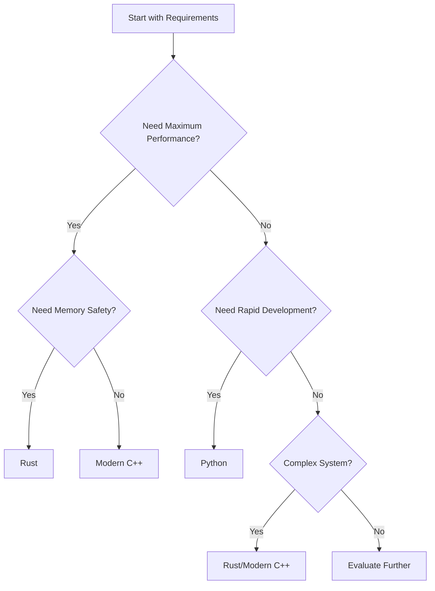

### Resources for Further Learning

#### Python
- 📚 [Real Python](https://realpython.com/)
- 📚 [Python Documentation](https://docs.python.org/)
- 📚 [Effective Python](https://effectivepython.com/)

#### Rust
- 📚 [The Rust Book](https://doc.rust-lang.org/book/)
- 📚 [Rust by Example](https://doc.rust-lang.org/rust-by-example/)
- 📚 [Rustlings](https://github.com/rust-lang/rustlings)

#### Modern C++
- 📚 [cppreference.com](https://en.cppreference.com/)
- 📚 [Modern C++ Tutorial](https://github.com/ChuanqiXiang9/Modern-CPP-Tutorial)
- 📚 [C++ Core Guidelines](https://isocpp.github.io/CppCoreGuidelines/)

---

## 🙏 Thank You!

### Questions & Discussion

Feel free to ask questions about:
- 🔧 Specific implementation details
- 🚀 Performance optimization techniques
- 🌐 Real-world use cases
- 📚 Learning resources
- 🔄 Migration strategies

### Contact Information

- 📧 Email: [your-email@example.com]
- 💻 GitHub: [github.com/yourusername]
- 🐦 Twitter: [@yourhandle]
- 📝 Blog: [yourblog.com]

---

*This presentation was created using examples from the lds-gen project, which implements low-discrepancy sequence generators in Python, Rust, and Modern C++.*