# Toolchains in Rust, Python, and Modern C++

## 📚 Table of Contents

1. [Introduction](#introduction)
2. [What is a Toolchain?](#what-is-a-toolchain)
3. [Python Toolchain](#python-toolchain)
4. [Rust Toolchain](#rust-toolchain)
5. [Modern C++ Toolchain](#modern-c-toolchain)
6. [Build Systems Comparison](#build-systems-comparison)
7. [Package Management](#package-management)
8. [Testing Frameworks](#testing-frameworks)
9. [CI/CD Integration](#cicd-integration)
10. [Toolchain Selection Guide](#toolchain-selection-guide)
11. [Conclusion](#conclusion)

---

## 🎯 Introduction

### Overview
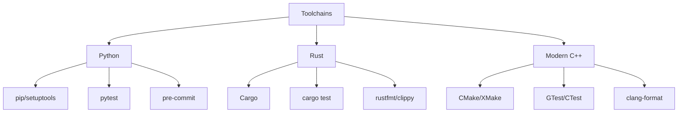

### What We'll Cover
- 🛠️ **Build Systems**: How code is compiled and built
- 📦 **Package Management**: Dependency resolution and distribution
- 🧪 **Testing**: Automated testing frameworks and integration
- 🔧 **Development Tools**: Linters, formatters, and code quality tools
- 🚀 **CI/CD**: Continuous integration and deployment

---

## ⚙️ What is a Toolchain?

### Definition
A **toolchain** is a set of programming tools used to create a software product. The tools are used in a chain-like fashion, where the output of one tool becomes the input for the next.

### Components
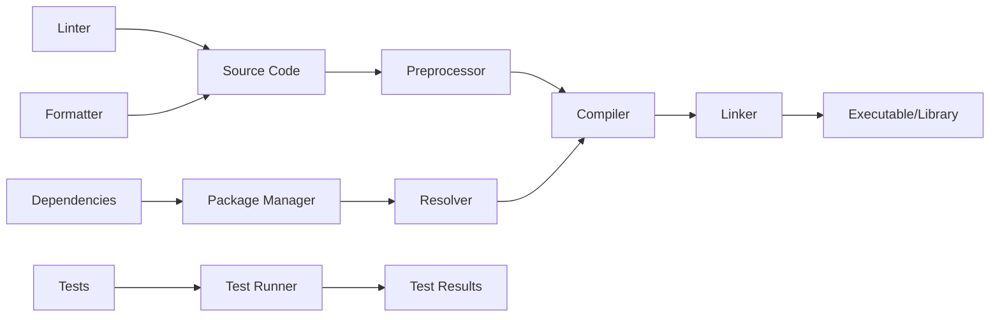

### Toolchain Evolution
| Era | Characteristics | Tools |
|-----|----------------|-------|
| **1970s-80s** | Manual compilation | make, cc, ar |
| **1990s-2000s** | IDE integration | Visual Studio, Eclipse |
| **2010s** | Package managers | npm, pip, Cargo |
| **2020s** | Integrated toolchains | Rust, Modern Python, C++20 |

---

## 🐍 Python Toolchain

### Python Toolchain Overview
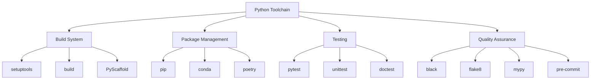

### Build System Configuration

#### pyproject.toml
```toml
[build-system]
# AVOID CHANGING REQUIRES: IT WILL BE UPDATED BY PYSCAFFOLD!
requires = ["setuptools>=46.1.0", "setuptools_scm[toml]>=5"]
build-backend = "setuptools.build_meta"

[tool.setuptools_scm]
# For smarter version schemes and other configuration options,
# check out https://github.com/pypa/setuptools_scm
version_scheme = "no-guess-dev"
```

#### setup.cfg
```ini
[metadata]
name = lds-gen
description = Low Discrepancy Sequence Generation
author = Wai-Shing Luk
author_email = luk036@gmail.com
license = MIT
license_files = LICENSE.txt
long_description = file: README.md
long_description_content_type = text/markdown; charset=UTF-8; variant=GFM
url = https://luk036.github.io/lds-gen/

[options]
zip_safe = False
packages = find_namespace:
include_package_data = True
package_dir =
    =src
install_requires =
    importlib-metadata; python_version<"3.9"

[options.extras_require]
testing =
    setuptools
    pytest
    pytest-cov

docs =
    sphinx
    sphinxcontrib-svgbob
    myst-parser
```

### Package Management

#### Requirements Structure
```
requirements/
├── default.txt      # Runtime dependencies
├── test.txt         # Test dependencies  
├── doc.txt          # Documentation dependencies
└── README.md        # Requirements documentation
```

#### requirements/default.txt
```txt
decorator>=4.1.0
```

#### requirements/test.txt
```txt
# codecov>=2.0.9
coverage>=4.4.1
pytest>=2.6.0
pytest-benchmark>=3.0.0
pytest-cov>=2.5.0
```

### Development Tools

#### Pre-commit Configuration (.pre-commit-config.yaml)
```yaml
exclude: "^docs/conf.py"

repos:
  - repo: https://github.com/pre-commit/pre-commit-hooks
    rev: v4.4.0
    hooks:
      - id: trailing-whitespace
      - id: check-added-large-files
      - id: check-ast
      - id: check-json
      - id: check-merge-conflict
      - id: check-yaml

  - repo: https://github.com/PyCQA/isort
    rev: 5.12.0
    hooks:
      - id: isort

  - repo: https://github.com/psf/black
    rev: 23.7.0
    hooks:
      - id: black
        language_version: python3

  - repo: https://github.com/PyCQA/flake8
    rev: 6.1.0
    hooks:
      - id: flake8
```

#### Testing Configuration (tox.ini)
```ini
[tox]
minversion = 3.24
envlist = default
isolated_build = True

[testenv]
description = Invoke pytest to run automated tests
setenv =
    TOXINIDIR = {toxinidir}
passenv =
    HOME
    SETUPTOOLS_*
extras =
    testing
commands =
    pytest {posargs}

[testenv:{docs,doctests,linkcheck}]
description =
    docs: Invoke sphinx-build to build the docs
    doctests: Invoke sphinx-build to run doctests
    linkcheck: Check for broken links in the documentation
passenv =
    SETUPTOOLS_*
setenv =
    DOCSDIR = {toxinidir}/docs
    BUILDDIR = {toxinidir}/docs/_build
    docs: BUILD = html
    doctests: BUILD = doctest
    linkcheck: BUILD = linkcheck
deps =
    -r {toxinidir}/docs/requirements.txt
commands =
    sphinx-build --color -b {env:BUILD} -d "{env:BUILDDIR}/doctrees" "{env:DOCSDIR}" "{env:BUILDDIR}/{env:BUILD}" {posargs}
```

### Python Toolchain Workflow
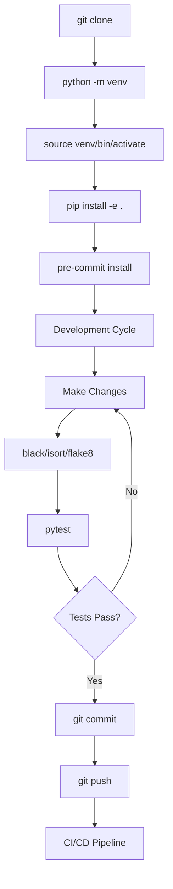

---

## 🦀 Rust Toolchain

### Rust Toolchain Overview
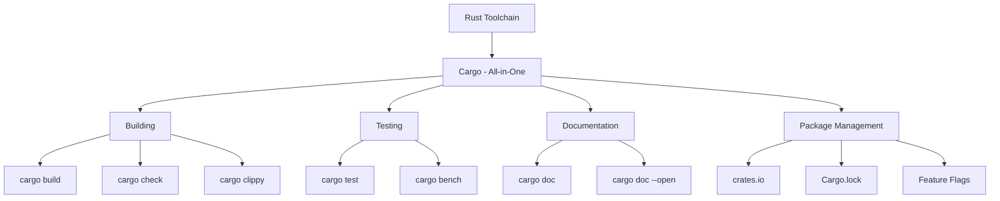

### Cargo Configuration

#### Cargo.toml
```toml
[package]
name = "lds-gen"
version = "0.1.0"
edition = "2024"
description = "Low-Discrepancy Sequence (LDS) Generator in Rust"
authors = ["Wai-Shing Luk <luk036@gmail.com>"]
license = "MIT"
repository = "https://github.com/luk036/lds-gen"
readme = "README.md"
keywords = ["low-discrepancy", "quasi-monte-carlo", "halton", "van-der-corput", "numerical-integration"]
categories = ["algorithms", "science", "mathematics"]

[dependencies]
clap = { version = "4.5", features = ["derive"] }
once_cell = "1.20"  # For thread-safe lazy initialization

[dev-dependencies]
approx = "0.5"  # For floating point comparisons in tests

[[bin]]
name = "lds-gen"
path = "src/main.rs"

[lib]
name = "lds_gen"
path = "src/lib.rs"

[profile.release]
lto = true
codegen-units = 1
panic = "abort"

[profile.dev]
debug = true
```

#### Cargo.lock (Auto-generated)
```toml
# This file is automatically @generated by Cargo.
# It is not intended for manual editing.
version = 4

[[package]]
name = "lds-gen"
version = "0.1.0"
dependencies = [
 "clap",
 "once_cell",
]

[[package]]
name = "clap"
version = "4.5.4"
source = "registry+https://github.com/rust-lang/crates.io-index"
checksum = "90bc06c527b32b7c19d3c9fc0e92afe56a182ee92ce906cb112549e033f1be817"
dependencies = [
 "clap_builder",
 "clap_derive",
]
# ... more dependencies
```

### Rust Tooling Features

#### Built-in Commands
```bash
# Building
cargo build              # Debug build
cargo build --release    # Release build
cargo check              # Quick compile check

# Testing
cargo test               # Run all tests
cargo test --release     # Run tests in release mode
cargo bench              # Run benchmarks

# Documentation
cargo doc                # Generate documentation
cargo doc --open         # Generate and open docs

# Code Quality
cargo clippy             # Lint checks
cargo fmt                # Format code

# Package Management
cargo search <term>      # Search crates.io
cargo add <crate>        # Add dependency
cargo update             # Update dependencies

# Publishing
cargo publish            # Publish to crates.io
```

#### Workspace Configuration
```toml
# In root Cargo.toml
[workspace]
members = [
    "core",
    "cli",
    "bindings/python",
    "examples/basic",
]

[workspace.dependencies]
# Shared dependencies for all workspace members
serde = "1.0"
tokio = "1.0"
```

### Testing in Rust

#### Test Organization
```rust
// src/lib.rs
#[cfg(test)]
mod tests {
    use super::*;
    use approx::assert_relative_eq;

    #[test]
    fn test_vdc_function() {
        assert_eq!(vdc(11, 2), 0.8125);
        assert_eq!(vdc(0, 2), 0.0);
        assert_eq!(vdc(1, 2), 0.5);
    }

    #[test]
    fn test_vdcorput_pop() {
        let mut vgen = VdCorput::new(2);
        vgen.reseed(0);
        assert_eq!(vgen.pop(), 0.5);
        assert_eq!(vgen.pop(), 0.25);
        assert_eq!(vgen.pop(), 0.75);
    }

    #[test]
    #[should_panic]
    fn test_invalid_base() {
        let _vgen = VdCorput::new(1); // Should panic
    }
}
```

#### Benchmark Tests
```rust
// benches/vdcorput.rs
use criterion::{black_box, criterion_group, criterion_main, Criterion};
use lds_gen::VdCorput;

fn bench_vdcorput_pop(c: &mut Criterion) {
    let mut vgen = VdCorput::new(2);
    vgen.reseed(0);
    
    c.bench_function("vdcorput_pop", |b| {
        b.iter(|| {
            vgen.pop();
            vgen.reseed(0); // Reset for fair comparison
        })
    });
}

criterion_group!(benches, bench_vdcorput_pop);
criterion_main!(benches);
```

### Rust Toolchain Workflow
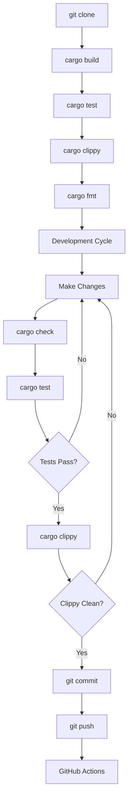

---

## 🚀 Modern C++ Toolchain

### C++ Toolchain Overview
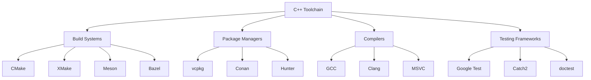

### CMake Configuration

#### CMakeLists.txt
```cmake
cmake_minimum_required(VERSION 3.20)
project(lds_gen VERSION 1.0.0 LANGUAGES CXX)

set(CMAKE_CXX_STANDARD 20)
set(CMAKE_CXX_STANDARD_REQUIRED ON)
set(CMAKE_CXX_EXTENSIONS OFF)

# Options
option(BUILD_SHARED_LIBS "Build shared library" OFF)
option(BUILD_TESTS "Build tests" ON)
option(BUILD_EXAMPLES "Build examples" ON)

# Include directories
include_directories(${CMAKE_CURRENT_SOURCE_DIR}/include)

# Library target
add_library(lds_gen
    src/lds.cpp
    src/ilds.cpp
    src/sphere_n.cpp
)

target_include_directories(lds_gen PUBLIC
    $<BUILD_INTERFACE:${CMAKE_CURRENT_SOURCE_DIR}/include>
    $<INSTALL_INTERFACE:include>
)

# Compiler-specific options
if(MSVC)
    target_compile_options(lds_gen PRIVATE /W4 /permissive-)
else()
    target_compile_options(lds_gen PRIVATE -Wall -Wextra -Wpedantic)
endif()

# Install targets
install(TARGETS lds_gen
    EXPORT lds_gen-targets
    LIBRARY DESTINATION lib
    ARCHIVE DESTINATION lib
    RUNTIME DESTINATION bin
    INCLUDES DESTINATION include
)

install(DIRECTORY include/ DESTINATION include)

install(EXPORT lds_gen-targets
    FILE lds_gen-config.cmake
    NAMESPACE lds_gen::
    DESTINATION lib/cmake/lds_gen
)
```

#### XMake Configuration

#### xmake.lua
```lua
add_rules("mode.debug", "mode.release")

set_languages("c++20")

target("lds_gen")
    set_kind("static")
    add_headerfiles("include/(lds_gen/**.hpp)")
    add_files("src/lds.cpp", "src/ilds.cpp", "src/sphere_n.cpp")
    add_includedirs("include", {public = true})

    -- C++20 features
    add_cxxflags("-std=c++20", "-Wall", "-Wextra", "-pedantic")

    if is_mode("debug") then
        add_defines("DEBUG")
        add_cxxflags("-g", "-O0")
    else
        add_cxxflags("-O3")
    end

target("test_lds")
    set_kind("binary")
    add_deps("lds_gen")
    add_files("tests/test_lds.cpp")
    add_includedirs("include")

    -- Download doctest if not present
    before_build(function (target)
        local doctest_path = path.join(target:scriptdir(), "tests", "doctest.h")
        if not os.isfile(doctest_path) then
            print("Downloading doctest...")
            os.execv("curl", {"-L", "https://raw.githubusercontent.com/doctest/doctest/v2.4.11/doctest/doctest.h", "-o", doctest_path})
        end
    end)

target("example")
    set_kind("binary")
    add_deps("lds_gen")
    add_files("examples/example.cpp")
    add_includedirs("include")
```

### Package Management

#### vcpkg.json
```json
{
  "name": "lds-gen",
  "version": "1.0.0",
  "description": "Low-Discrepancy Sequence Generator C++ Library",
  "dependencies": [
    {
      "name": "vcpkg-cmake",
      "host": true
    },
    {
      "name": "vcpkg-cmake-config",
      "host": true
    }
  ],
  "features": {
    "tests": {
      "description": "Build with testing support",
      "dependencies": [
        "doctest"
      ]
    },
    "benchmarks": {
      "description": "Build with benchmark support",
      "dependencies": [
        "benchmark"
      ]
    }
  }
}
```

#### conanfile.txt
```ini
[requires]
fmt/8.1.1
gtest/1.11.0
doctest/2.4.9

[generators]
CMakeDeps
CMakeToolchain

[options]
shared=False

[settings]
os=Windows
arch=x64
compiler=Visual Studio
compiler.version=16
compiler.runtime=MD
build_type=Release
```

### Testing Frameworks

#### doctest Integration
```cpp
// tests/test_lds.cpp
#define DOCTEST_CONFIG_IMPLEMENT_WITH_MAIN
#include "doctest.h"
#include "lds_gen/lds.hpp"

using namespace lds_gen;

TEST_CASE("Van der Corput sequence function") {
    CHECK(vdc(11, 2) == 0.8125);
    CHECK(vdc(0, 2) == 0.0);
    CHECK(vdc(1, 2) == 0.5);
    CHECK(vdc(2, 2) == 0.25);
}

TEST_CASE("VdCorput class") {
    SUBCASE("Default constructor") {
        VdCorput vgen;
        vgen.reseed(0);
        CHECK(vgen.pop() == 0.5);
        CHECK(vgen.pop() == 0.25);
    }
    
    SUBCASE("Custom base") {
        VdCorput vgen(3);
        vgen.reseed(0);
        CHECK(vgen.pop() == doctest::Approx(1.0/3.0));
    }
    
    SUBCASE("Reseed functionality") {
        VdCorput vgen;
        vgen.reseed(5);
        double first = vgen.pop();
        vgen.reseed(5);
        CHECK(vgen.pop() == first);
    }
}

TEST_CASE("Halton sequence") {
    Halton hgen({2, 3});
    hgen.reseed(0);
    
    auto result = hgen.pop();
    CHECK(result[0] == 0.5);
    CHECK(result[1] == doctest::Approx(1.0/3.0));
}
```

### Continuous Integration

#### GitHub Actions for C++
```yaml
# .github/workflows/ci.yml
name: CI

on:
  push:
    branches: [ main, develop ]
  pull_request:
    branches: [ main ]

jobs:
  build:
    runs-on: ${{ matrix.os }}
    strategy:
      matrix:
        os: [ubuntu-latest, windows-latest, macos-latest]
        build_type: [Debug, Release]

    steps:
    - uses: actions/checkout@v3
    
    - name: Install dependencies (Ubuntu)
      if: runner.os == 'Linux'
      run: |
        sudo apt update
        sudo apt install -y cmake ninja-build
    
    - name: Install dependencies (macOS)
      if: runner.os == 'macOS'
      run: |
        brew install cmake ninja
    
    - name: Configure CMake
      run: |
        cmake -B build -S . \
          -DCMAKE_BUILD_TYPE=${{ matrix.build_type }} \
          -DBUILD_TESTS=ON \
          -G "Ninja"
    
    - name: Build
      run: cmake --build build --config ${{ matrix.build_type }}
    
    - name: Test
      run: |
        cd build
        ctest --output-on-failure -C ${{ matrix.build_type }}
```

### C++ Toolchain Workflow
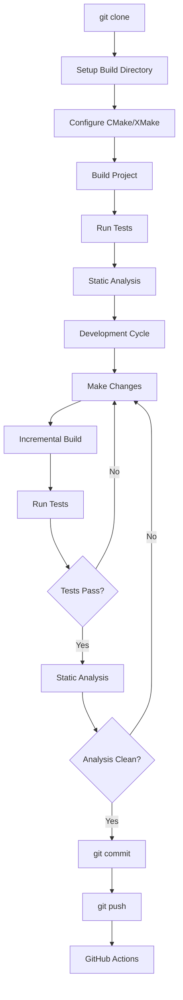

---

## ⚖️ Build Systems Comparison

### Feature Comparison Matrix

| Feature | Python | Rust | Modern C++ |
|---------|--------|------|------------|
| **Build Speed** | ⭐⭐⭐⭐ | ⭐⭐⭐⭐⭐ | ⭐⭐ |
| **Dependency Management** | ⭐⭐⭐⭐ | ⭐⭐⭐⭐⭐ | ⭐⭐ |
| **Cross-Platform** | ⭐⭐⭐⭐⭐ | ⭐⭐⭐⭐⭐ | ⭐⭐⭐⭐ |
| **IDE Integration** | ⭐⭐⭐⭐ | ⭐⭐⭐⭐ | ⭐⭐⭐⭐⭐ |
| **Configuration Simplicity** | ⭐⭐⭐ | ⭐⭐⭐⭐⭐ | ⭐⭐ |
| **Incremental Builds** | N/A | ⭐⭐⭐⭐⭐ | ⭐⭐⭐⭐ |
| **Debugging Support** | ⭐⭐⭐⭐ | ⭐⭐⭐⭐ | ⭐⭐⭐⭐⭐ |

### Build Time Comparison
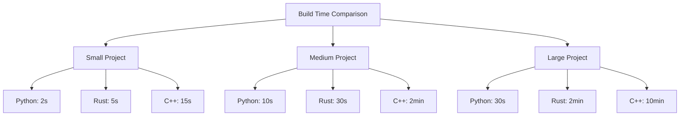

### Configuration Complexity

#### Python (Simplest)
```toml
# pyproject.toml - minimal configuration
[build-system]
requires = ["setuptools>=46.1.0"]
build-backend = "setuptools.build_meta"

[project]
name = "my-project"
version = "0.1.0"
dependencies = ["requests>=2.0"]
```

#### Rust (Integrated)
```toml
# Cargo.toml - integrated configuration
[package]
name = "my-project"
version = "0.1.0"
edition = "2021"

[dependencies]
serde = "1.0"

[dev-dependencies]
tokio-test = "0.4"
```

#### C++ (Most Complex)
```cmake
# CMakeLists.txt - complex configuration
cmake_minimum_required(VERSION 3.20)
project(MyProject VERSION 1.0.0)

set(CMAKE_CXX_STANDARD 20)
find_package(Boost REQUIRED)

add_library(my_lib src/main.cpp)
target_link_libraries(my_lib Boost::boost)

install(TARGETS my_lib DESTINATION lib)
```

---

## 📦 Package Management

### Package Ecosystems

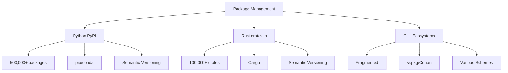

### Dependency Resolution

#### Python (pip)
```bash
# requirements.txt
numpy>=1.20.0
pandas>=1.3.0
scipy>=1.7.0

# Install
pip install -r requirements.txt

# Dependency tree
pip show numpy
```

#### Rust (Cargo)
```toml
[dependencies]
serde = "1.0"           # Latest 1.x
tokio = { version = "1.0", features = ["full"] }
log = "0.4"

# Development dependencies
[dev-dependencies]
tokio-test = "0.4"
criterion = "0.5"

# Feature flags
[features]
default = ["std"]
std = []
```

#### C++ (vcpkg)
```json
{
  "name": "myproject",
  "version": "1.0.0",
  "dependencies": [
    "boost",
    "fmt",
    "gtest"
  ],
  "builtin-baseline": "2023-04-15"
}
```

### Version Management Strategies

| Strategy | Python | Rust | C++ |
|----------|--------|------|-----|
| **Semantic Versioning** | ✅ Standard | ✅ Standard | ⚠️ Inconsistent |
| **Lock Files** | ❌ pip-tools | ✅ Cargo.lock | ⚠️ Emerging |
| **Feature Flags** | ❌ Limited | ✅ Native | ⚠️ Manual |
| **Conflict Resolution** | ⚠️ Basic | ✅ Advanced | ❌ Manual |

---

## 🧪 Testing Frameworks

### Testing Philosophy Comparison

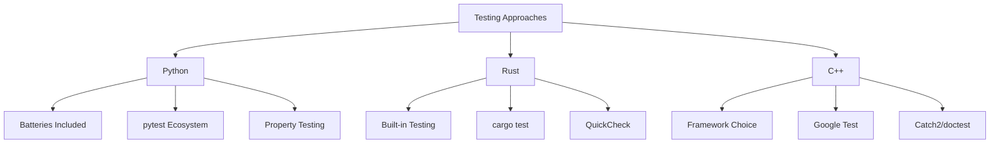

### Test Discovery and Execution

#### Python (pytest)
```python
# conftest.py
import pytest

@pytest.fixture
def sample_sequence():
    """Fixture providing test data"""
    return [0.5, 0.25, 0.75, 0.125]

# test_lds.py
import pytest
from lds_gen import VdCorput

class TestVdCorput:
    def test_basic_functionality(self, sample_sequence):
        vgen = VdCorput(2)
        vgen.reseed(0)
        
        for expected in sample_sequence:
            assert abs(vgen.pop() - expected) < 1e-10
    
    @pytest.mark.parametrize("base,expected", [
        (2, 0.5),
        (3, 1.0/3.0),
        (5, 0.2),
    ])
    def test_different_bases(self, base, expected):
        vgen = VdCorput(base)
        vgen.reseed(0)
        assert abs(vgen.pop() - expected) < 1e-10
    
    def test_error_handling(self):
        with pytest.raises(ValueError):
            VdCorput(1)  # Invalid base
```

#### Rust (Built-in)
```rust
#[cfg(test)]
mod tests {
    use super::*;
    use approx::assert_relative_eq;

    #[test]
    fn test_vdc_function() {
        assert_eq!(vdc(11, 2), 0.8125);
        assert_eq!(vdc(0, 2), 0.0);
        assert_eq!(vdc(1, 2), 0.5);
    }

    #[test]
    #[should_panic(expected = "Base must be >= 2")]
    fn test_invalid_base() {
        let _vgen = VdCorput::new(1);
    }

    #[test]
    fn test_thread_safety() {
        use std::thread;
        
        let mut handles = vec![];
        for i in 0..10 {
            let handle = thread::spawn(move || {
                let mut vgen = VdCorput::new(2);
                vgen.reseed(i as u32);
                vgen.pop()
            });
            handles.push(handle);
        }
        
        for handle in handles {
            assert!(handle.join().unwrap() > 0.0);
        }
    }
}
```

#### C++ (doctest)
```cpp
#define DOCTEST_CONFIG_IMPLEMENT_WITH_MAIN
#include "doctest.h"
#include "lds_gen/lds.hpp"

TEST_CASE("Van der Corput sequence") {
    SUBCASE("Basic functionality") {
        CHECK(lds_gen::vdc(11, 2) == 0.8125);
        CHECK(lds_gen::vdc(0, 2) == 0.0);
        CHECK(lds_gen::vdc(1, 2) == 0.5);
    }
    
    SUBCASE("Different bases") {
        CHECK(lds_gen::vdc(1, 3) == doctest::Approx(1.0/3.0));
        CHECK(lds_gen::vdc(1, 5) == doctest::Approx(1.0/5.0));
    }
    
    SUBCASE("Edge cases") {
        CHECK(lds_gen::vdc(0, 2) == 0.0);
        CHECK_THROWS_AS(lds_gen::VdCorput(1), std::invalid_argument);
    }
}

TEST_CASE_TEMPLATE("Sequence generators", T, 
    lds_gen::VdCorput, 
    lds_gen::Halton,
    lds_gen::Circle) {
    // Template tests for different generator types
    SECTION("Reseed functionality") {
        T gen;
        gen.reseed(42);
        auto first = gen.pop();
        gen.reseed(42);
        CHECK(gen.pop() == first);
    }
}
```

### Test Coverage and Benchmarking

#### Python Coverage
```bash
# Run tests with coverage
pytest --cov=lds_gen --cov-report=html --cov-report=term-missing

# Coverage configuration (.coveragerc)
[run]
source = src
omit = 
    tests/*
    setup.py

[report]
exclude_lines =
    pragma: no cover
    def __repr__
    raise AssertionError
    raise NotImplementedError
```

#### Rust Benchmarks
```rust
// benches/vdcorput.rs
use criterion::{black_box, criterion_group, criterion_main, Criterion};
use lds_gen::VdCorput;

fn bench_vdcorput_creation(c: &mut Criterion) {
    c.bench_function("vdcorput_creation", |b| {
        b.iter(|| VdCorput::new(black_box(2)))
    });
}

fn bench_vdcorput_pop(c: &mut Criterion) {
    let mut vgen = VdCorput::new(2);
    vgen.reseed(0);
    
    c.bench_function("vdcorput_pop", |b| {
        b.iter(|| {
            vgen.pop();
            vgen.reseed(0);
        })
    });
}

criterion_group!(benches, bench_vdcorput_creation, bench_vdcorput_pop);
criterion_main!(benches);
```

#### C++ Benchmarks (Google Benchmark)
```cpp
// benches/benchmark_lds.cpp
#include <benchmark/benchmark.h>
#include "lds_gen/lds.hpp"

static void BM_VdCorputCreation(benchmark::State& state) {
    for (auto _ : state) {
        benchmark::DoNotOptimize(lds_gen::VdCorput(2));
    }
}

static void BM_VdCorputPop(benchmark::State& state) {
    lds_gen::VdCorput vgen(2);
    vgen.reseed(0);
    
    for (auto _ : state) {
        benchmark::DoNotOptimize(vgen.pop());
        vgen.reseed(0);
    }
}

BENCHMARK(BM_VdCorputCreation);
BENCHMARK(BM_VdCorputPop);

BENCHMARK_MAIN();
```

---

## 🚀 CI/CD Integration

### CI/CD Pipeline Comparison

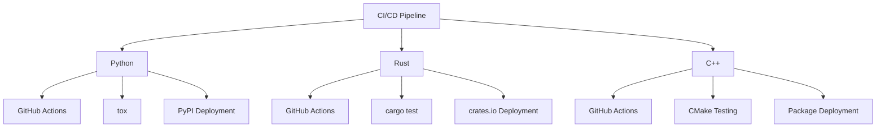

### GitHub Actions Workflows

#### Python CI
```yaml
# .github/workflows/python.yml
name: Python CI

on:
  push:
    branches: [ main, develop ]
  pull_request:
    branches: [ main ]

jobs:
  test:
    runs-on: ${{ matrix.os }}
    strategy:
      matrix:
        os: [ubuntu-latest, windows-latest, macos-latest]
        python-version: [3.8, 3.9, '3.10', 3.11]

    steps:
    - uses: actions/checkout@v3
    
    - name: Set up Python ${{ matrix.python-version }}
      uses: actions/setup-python@v4
      with:
        python-version: ${{ matrix.python-version }}
    
    - name: Install dependencies
      run: |
        python -m pip install --upgrade pip
        pip install -e .[testing,docs]
    
    - name: Lint with flake8
      run: |
        flake8 src tests
    
    - name: Check formatting with black
      run: |
        black --check src tests
    
    - name: Type check with mypy
      run: |
        mypy src
    
    - name: Test with pytest
      run: |
        pytest --cov=lds_gen --cov-report=xml
    
    - name: Upload coverage to Codecov
      uses: codecov/codecov-action@v3
      with:
        file: ./coverage.xml

  deploy:
    needs: test
    runs-on: ubuntu-latest
    if: github.event_name == 'push' && github.ref == 'refs/heads/main'
    
    steps:
    - uses: actions/checkout@v3
    - name: Set up Python
      uses: actions/setup-python@v4
      with:
        python-version: '3.10'
    
    - name: Install dependencies
      run: |
        python -m pip install --upgrade pip
        pip install build twine
    
    - name: Build package
      run: python -m build
    
    - name: Publish to PyPI
      env:
        TWINE_USERNAME: __token__
        TWINE_PASSWORD: ${{ secrets.PYPI_API_TOKEN }}
      run: twine upload dist/*
```

#### Rust CI
```yaml
# .github/workflows/rust.yml
name: Rust CI

on:
  push:
    branches: [ main, develop ]
  pull_request:
    branches: [ main ]

jobs:
  test:
    runs-on: ${{ matrix.os }}
    strategy:
      matrix:
        os: [ubuntu-latest, windows-latest, macos-latest]
        rust: [stable, beta, nightly]

    steps:
    - uses: actions/checkout@v3
    
    - name: Install Rust ${{ matrix.rust }}
      uses: actions-rs/toolchain@v1
      with:
        toolchain: ${{ matrix.rust }}
        override: true
    
    - name: Cache cargo registry
      uses: actions/cache@v3
      with:
        path: ~/.cargo/registry
        key: ${{ runner.os }}-cargo-registry-${{ hashFiles('**/Cargo.lock') }}
    
    - name: Cache cargo index
      uses: actions/cache@v3
      with:
        path: ~/.cargo/git
        key: ${{ runner.os }}-cargo-index-${{ hashFiles('**/Cargo.lock') }}
    
    - name: Cache cargo build
      uses: actions/cache@v3
      with:
        path: target
        key: ${{ runner.os }}-cargo-build-target-${{ hashFiles('**/Cargo.lock') }}
    
    - name: Check formatting
      run: cargo fmt --all -- --check
    
    - name: Clippy
      run: cargo clippy --all-targets --all-features -- -D warnings
    
    - name: Build
      run: cargo build --verbose
    
    - name: Run tests
      run: cargo test --verbose
    
    - name: Run benchmarks
      if: matrix.rust == 'stable'
      run: cargo bench

  security:
    runs-on: ubuntu-latest
    steps:
    - uses: actions/checkout@v3
    - name: Security audit
      uses: actions-rs/audit-check@v1
      with:
        token: ${{ secrets.GITHUB_TOKEN }}

  deploy:
    needs: [test, security]
    runs-on: ubuntu-latest
    if: github.event_name == 'push' && github.ref == 'refs/heads/main'
    
    steps:
    - uses: actions/checkout@v3
    - name: Publish to crates.io
      uses: actions-rs/cargo@v1
      with:
        command: publish
        args: --token ${{ secrets.CRATES_IO_TOKEN }}
```

#### C++ CI
```yaml
# .github/workflows/cpp.yml
name: C++ CI

on:
  push:
    branches: [ main, develop ]
  pull_request:
    branches: [ main ]

jobs:
  build:
    runs-on: ${{ matrix.os }}
    strategy:
      matrix:
        os: [ubuntu-latest, windows-latest, macos-latest]
        build_type: [Debug, Release]
        compiler:
          - { cc: gcc, cxx: g++ }
          - { cc: clang, cxx: clang++ }
        exclude:
          - os: windows-latest
            compiler: { cc: clang, cxx: clang++ }
          - os: macos-latest
            compiler: { cc: gcc, cxx: g++ }

    steps:
    - uses: actions/checkout@v3
    
    - name: Install dependencies (Ubuntu)
      if: runner.os == 'Linux'
      run: |
        sudo apt update
        sudo apt install -y cmake ninja-build
    
    - name: Install dependencies (macOS)
      if: runner.os == 'macOS'
      run: |
        brew install cmake ninja
    
    - name: Setup vcpkg
      uses: lukka/run-vcpkg@v10
      with:
        vcpkgGitCommitId: 'latest'
    
    - name: Configure CMake
      run: |
        cmake -B build -S . \
          -DCMAKE_BUILD_TYPE=${{ matrix.build_type }} \
          -DBUILD_TESTS=ON \
          -DBUILD_BENCHMARKS=ON \
          -G "Ninja"
    
    - name: Build
      run: cmake --build build --config ${{ matrix.build_type }}
    
    - name: Test
      run: |
        cd build
        ctest --output-on-failure -C ${{ matrix.build_type }}
    
    - name: Run benchmarks
      if: matrix.build_type == 'Release'
      run: |
        cd build
        ./benchmarks/benchmark_lds

  code-quality:
    runs-on: ubuntu-latest
    steps:
    - uses: actions/checkout@v3
    
    - name: Install clang-tidy
      run: |
        sudo apt update
        sudo apt install -y clang-tidy
    
    - name: Run clang-tidy
      run: |
        cmake -B build -S . -DCMAKE_EXPORT_COMPILE_COMMANDS=ON
        run-clang-tidy -p build
```

---

## 🎯 Toolchain Selection Guide

### Decision Framework

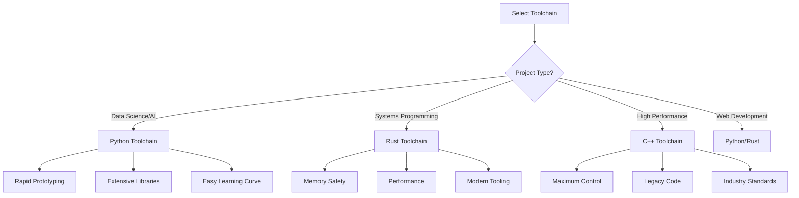

### Use Case Recommendations

| Scenario | Recommended Toolchain | Rationale |
|----------|---------------------|-----------|
| **Data Science** | Python | NumPy, pandas, extensive ecosystem |
| **Web Backend** | Python/Rust | Django/FastAPI vs Axum/Actix |
| **CLI Tools** | Rust | Single binary, great performance |
| **Game Development** | C++ | Industry standard, engines |
| **Embedded Systems** | Rust/C++ | Memory control, performance |
| **Scientific Computing** | Python/C++ | Python for prototyping, C++ for performance |
| **DevOps Tools** | Rust/Python | Performance vs rapid development |
| **Browser Extensions** | Rust/WASM | Performance and safety |

### Migration Strategies

#### From Python to Rust
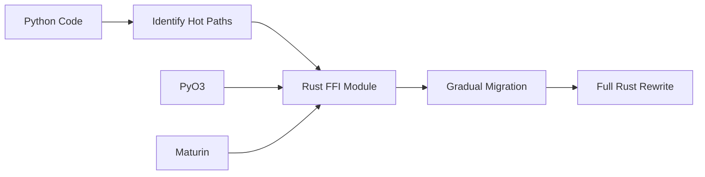

#### From C++ to Rust
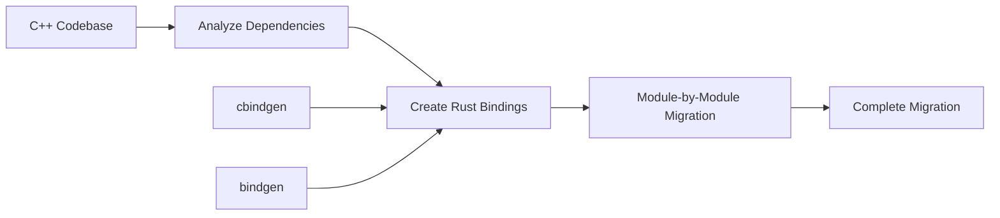

#### Hybrid Approach
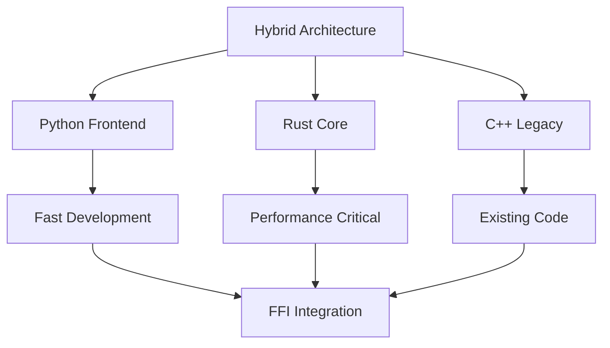

### Team Considerations

| Factor | Python | Rust | C++ |
|--------|--------|------|-----|
| **Learning Curve** | ⭐⭐ | ⭐⭐⭐⭐ | ⭐⭐⭐⭐⭐ |
| **Hiring Pool** | ⭐⭐⭐⭐⭐ | ⭐⭐⭐ | ⭐⭐⭐⭐ |
| **Documentation** | ⭐⭐⭐⭐⭐ | ⭐⭐⭐⭐ | ⭐⭐⭐ |
| **Community Support** | ⭐⭐⭐⭐⭐ | ⭐⭐⭐⭐ | ⭐⭐⭐⭐ |
| **Tooling Maturity** | ⭐⭐⭐⭐⭐ | ⭐⭐⭐⭐ | ⭐⭐⭐⭐⭐ |

---

## 📊 Summary and Future Trends

### Toolchain Evolution Timeline

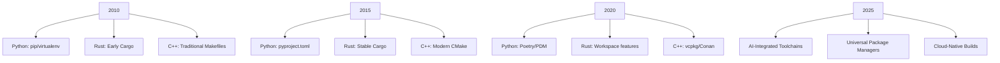

### Emerging Trends

#### 🤖 AI-Enhanced Tooling
- **GitHub Copilot**: Code completion and generation
- **AI-powered testing**: Automatic test generation
- **Smart dependency management**: ML-based recommendations
- **Automated optimization**: Compiler AI improvements

#### 🌐 Cloud-Native Toolchains
- **Remote compilation**: Cloud-based build farms
- **Containerized builds**: Docker/Kubernetes integration
- **Distributed testing**: Parallel test execution
- **Artifact management**: Cloud package repositories

#### 🔄 Cross-Language Interoperability
- **Universal build systems**: Bazel, Buck2
- **Language bridges**: PyO3, cxx, bindgen
- **Shared package formats**: WebAssembly components
- **Polyglot IDEs**: Multi-language support

### Best Practices Summary

#### 🔧 Configuration Management
```yaml
# Use version control for all configuration
# Keep configuration DRY
# Use feature flags for optional components
# Document configuration decisions
```

#### 📦 Dependency Management
```bash
# Pin critical dependencies
# Regular security audits
# Use lock files in production
# Monitor dependency health
```

#### 🧪 Testing Strategy
```yaml
# Test at multiple levels (unit, integration, system)
# Automate testing in CI/CD
# Maintain high code coverage
# Include performance tests
```

#### 🚀 Deployment Practices
```yaml
# Automate builds and deployments
# Use semantic versioning
# Maintain release notes
# Monitor production health
```

---

## 🎓 Conclusion

### Key Takeaways

1. **🐍 Python Toolchain**: Best for rapid development, extensive ecosystem, and data science
2. **🦀 Rust Toolchain**: Superior for performance, safety, and modern development experience
3. **🚀 C++ Toolchain**: Essential for maximum performance and legacy system integration

### Decision Matrix

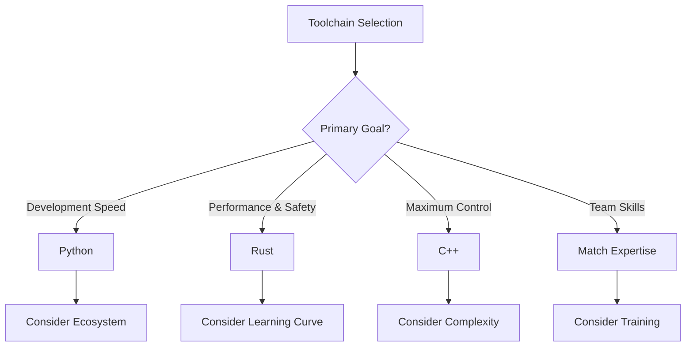

### Future Outlook

#### Short-term (1-2 years)
- Enhanced AI integration in all toolchains
- Improved cross-language interoperability
- Better container and cloud integration

#### Long-term (3-5 years)
- Universal package management solutions
- AI-driven code optimization
- Real-time collaborative development tools

### Recommendations

1. **For New Projects**: Start with Rust unless you have specific Python/C++ requirements
2. **For Existing Codebases**: Gradual migration using hybrid approaches
3. **For Teams**: Invest in training and choose based on long-term goals
4. **For Organizations**: Standardize on 2-3 primary toolchains for efficiency

---

## 🙏 Thank You!

### Questions & Discussion

Topics we can explore further:
- 🔧 Specific toolchain setup guidance
- 🚀 Migration strategies and best practices
- 📊 Performance optimization techniques
- 🌐 Cross-language integration patterns
- 🤖 AI-enhanced development workflows

### Resources

#### Python Toolchain
- 📚 [Python Packaging User Guide](https://packaging.python.org/)
- 🛠️ [pytest Documentation](https://docs.pytest.org/)
- 📦 [Poetry Documentation](https://python-poetry.org/)

#### Rust Toolchain
- 📚 [The Rust Book](https://doc.rust-lang.org/book/)
- 🛠️ [Cargo Guide](https://doc.rust-lang.org/cargo/)
- 📦 [crates.io](https://crates.io/)

#### C++ Toolchain
- 📚 [CMake Documentation](https://cmake.org/documentation/)
- 🛠️ [vcpkg Guide](https://vcpkg.io/)
- 📦 [Conan Center](https://conan.io/center/)

### Contact Information

- 📧 Email: [your-email@example.com]
- 💻 GitHub: [github.com/yourusername]
- 🐦 Twitter: [@yourhandle]
- 📝 Blog: [yourblog.com]

---

*This presentation explores toolchains using real configuration files from the lds-gen project, demonstrating practical implementations in Python, Rust, and Modern C++ environments.*